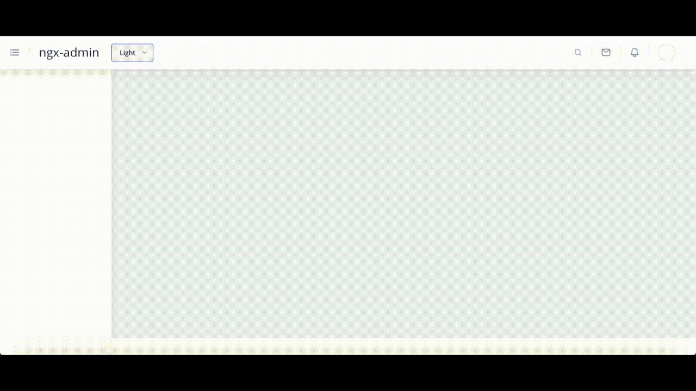
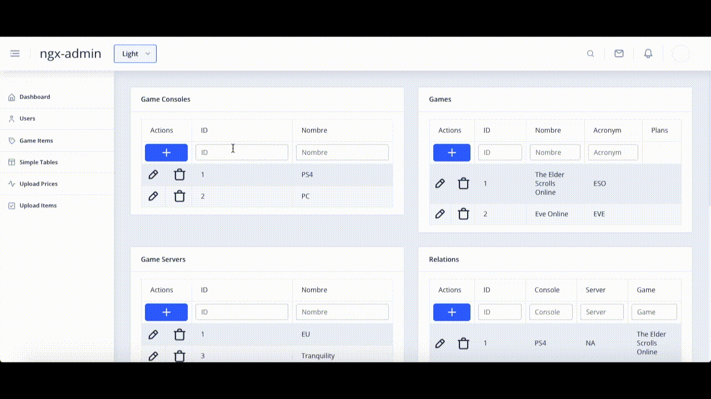

**@ngx-admin-panel** offers a configurable approach to admin panel development, the project focuses in replacing programming time by configuration time, making the whole admin-panel creation experience smoother, faster and straight forward.

Features:
 - Authentication (Login/Logout)
 - Design out of the box
 - Configurable tables with programmable callbacks (CRUD), notifications and status messages.
 - Flexibility to create custom components
 - Configuration of loading status behaviour.
 - Feedback message configurations.

**@ngx-admin-panel** won't suit you, IF: 
 - You have particular design requirements.
 - You need to allow the registration of new users via the login panel.

You'd only need to extend your app with `AdminApp`, run `this.build()` and check your admin panel runnnig! Provide menu options, enable authentication and other configurations to see it fully functional.

By adding `callbacks` to your components , you can configure your own endpoints to perform CRUD operations: 

> Admin Panel design and styles forked from [ngx-admin](https://akveo.github.io/ngx-admin/), an angular template built with [Nebular UI ](https://akveo.github.io/nebular/)

